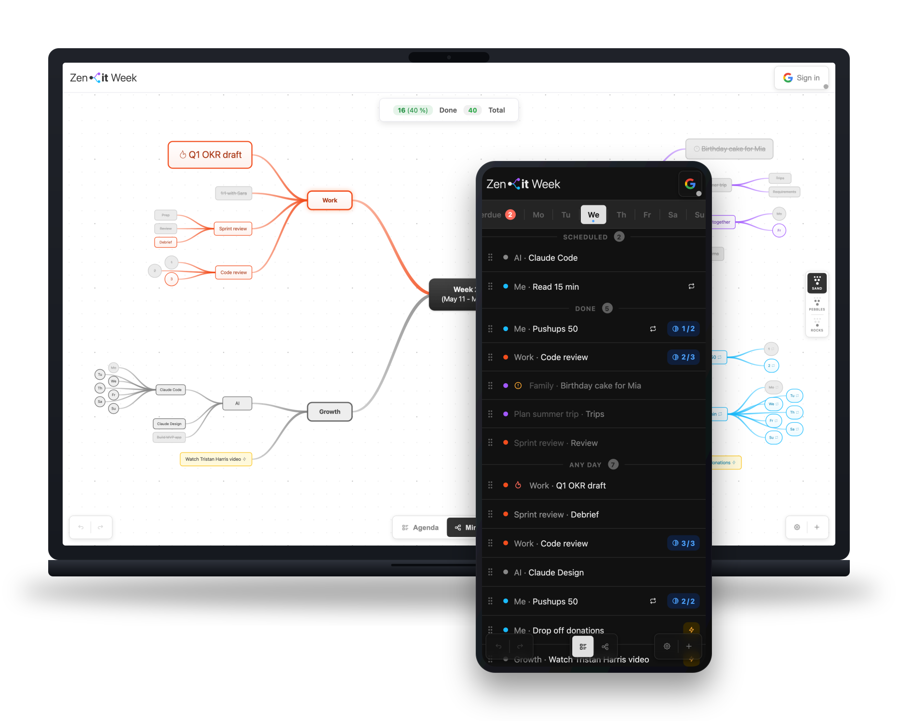

# Zenit Week

> Plan your week around what matters most — not what's just urgent.
> A visual mind-map planner that runs in your browser. No signup. No servers holding your data. Free.

[**Try it now →**](https://zenitweek.com/) · [Privacy](https://zenitweek.com/privacy) · [Available in English & Čeština](https://zenitweek.com/cs/)

---

## Why?

Most planners are flat lists. Zenit Week is a tree. You see your whole week — work, family, yourself — in one view, balance and all.

The "rocks first" idea: fill the jar with sand first and the big rocks won't fit. Reverse it and they do. Most weeks fail the same way — emails and small tasks fill the jar before the things that actually matter get a place. Zenit Week makes the rocks the easiest thing to see.

## Quick start

- **Online:** open [zenitweek.com](https://zenitweek.com/) and start in seconds.
- **Offline:** download `zenit-week.html` and open it in any modern browser. Your data is saved to the browser's IndexedDB. Optionally sign in with Google to sync to your own Drive.

No account is required. No tracking. Your data never touches Zenit Week's infrastructure.

## Features

- **Mind-map view** with a center node and radial branches. Defaults are Work, Family, Me — but every branch is yours to rename, recolor, add, or remove.
- **Two views, one week:** *Mindmap* for the whole-week picture, *Agenda* for day-by-day execution with Mon–Sun tabs and an Overdue lane.
- **View levels — Rocks, Pebbles, Sand:** zoom out to just the big rocks, fade out deep detail with pebbles, or reveal everything with sand.
- **Priorities (Normal / High / Critical):** scale layout space and visual weight; cascade to children automatically.
- **Counters** — type `Nx` in any task name to track progress (e.g. *Pushups 10x*); click to increment, every tick is timestamped.
- **Day indicators** — append `(mo, we, fr)` to a task to schedule it for those days (Czech tokens `po, út, st, čt, pá, so, ne` also work). `daily` schedules all seven days and auto-adds a 7-counter.
- **Reusable tasks** — flag tasks that repeat every week; *Transfer Reusable* copies them forward with counters reset.
- **Transfer Unfinished** — carry incomplete work into the next ISO week with one action. *Move to next week* relocates a single task and its subtree.
- **Effort baseline** — set a realistic activity-per-week target; the summary turns yellow at stretch, red at overload.
- **Quick-add** — floating input to drop a task straight onto any branch without touching the mind map.
- **Auto-layout** — automatic radial positioning after each change, toggleable in settings.
- **Drag to rebind / reorder** — drag a node onto another to re-parent it, or between siblings to reorder.
- **Daily log** — completed and ticked activities collected with timestamps and branch dots.
- **Light & dark theme** — respects `prefers-color-scheme` on first load.
- **Languages** — English and Čeština, with browser-language detection and a dismissable suggestion banner.
- **Optional Google Drive sync** — your own Drive, scope `drive.appdata` only, one file per week, never our servers. Conflict resolution by last-write-wins with CRDT tombstones, auto-polled every 10s.
- **Undo / Redo** — 100 levels.
- **Export & import** — full backup as JSON.
- **Touch-friendly** — pinch to zoom, swipe an agenda item right to mark done, left for options.

## Keyboard shortcuts

| Action | Shortcut |
| :--- | :--- |
| Switch to Mindmap / Agenda | `M` / `A` |
| Quick add (inbox item) | `Q` |
| Rename hovered node | `Enter` |
| Add child to hovered node | `Tab` |
| Delete hovered node | `Backspace` / `Delete` |
| Toggle done | `D` |
| Toggle unplanned | `U` |
| Toggle day for hovered node | `1`–`7` (Mon–Sun) |
| Clear all day indicators | `8` |
| Filter mindmap by day | `1`–`7` on empty canvas |
| Filter to Unscheduled / Overdue | `8` / `0` on empty canvas |
| Quick options menu | Right click |
| Undo | `Ctrl/⌘ + Z` |
| Redo | `Ctrl/⌘ + Shift + Z` or `Ctrl/⌘ + Y` |
| Close panel / dialog | `Esc` |

Drag the background to pan. Scroll or pinch to zoom. Double-click the canvas to fit everything to the view.

## Privacy

Zenit Week runs no servers that hold your data. Your data lives in your browser, or — if you opt in — in your own Google Drive's hidden app folder. We never see it. The only data that briefly touches our infrastructure is your IP address while the page loads, handled by our hosting provider Vercel. Signing in with Google goes through one small serverless function of ours that exchanges OAuth tokens; it never sees your plans.

Full details in the [privacy policy](https://zenitweek.com/privacy).

## Contributing

Architecture, development setup, and guidelines for pull requests are in [CONTRIBUTING.md](CONTRIBUTING.md).

## Sponsoring

If Zenit Week saves you time and headspace, you can support the project. *(Ko-fi link will appear here once the account is set up.)* Starring the repo also helps.

## License

MIT — see [LICENSE](LICENSE). Includes [Tabler Icons](https://tabler.io/icons) under MIT.
