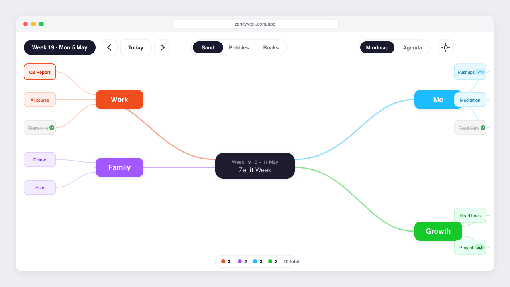

# Zenit Week

> Plan your week around what matters most — not what's just urgent.
> A visual mind-map planner that runs in your browser. No signup. No servers. Free.

[**Try it now →**](https://zenitweek.com/) · [Privacy](https://zenitweek.com/privacy) · [Available in English & Čeština](https://zenitweek.com/cs/)

---

## Why?

Most planners are flat lists. Zenit Week is a tree. You see your whole week — work, family, yourself — in one view, balance and all.

The "rocks first" idea: fill the jar with sand first and the big rocks won't fit. Reverse it and they do. Most weeks fail the same way — emails and small tasks fill the jar before the things that actually matter get a place. Zenit Week makes the rocks the easiest thing to see.

## Quick start

- **Online:** open [zenitweek.com](https://zenitweek.com/) and start in seconds.
- **Offline:** download `zenit-week.html` and open it in any modern browser. Your data is saved to the browser's `localStorage`. Optionally sign in with Google to sync to your own Drive.

No account is required. No tracking. Your data never touches Zenit Week's infrastructure.

## Features

- **Mind-map view** of the week, with branches for Work, Family, Me — all customizable.
- **Priorities** (Normal / High / Critical) that scale layout spacing and cascade to children.
- **Counters** — type `2x` in any task name to track progress (e.g. *Pushups 10x*).
- **Day indicators** — `(mo, we, fr)` schedules a task for those days.
- **View levels** — Sand (everything), Pebbles (hide deep tasks), Rocks (branches only).
- **Reusable & overflow tasks** — carry forward to the next week with a single action.
- **Daily log, Todo panel, Agenda view** — three lenses on the same week.
- **Light & dark theme**, English & Czech UI.
- **Optional Google Drive sync** — your own Drive, scope `drive.appdata` only, never our servers.
- **Undo / Redo** — 100 levels.
- **Export & import** — full backup as JSON.

## Keyboard shortcuts

Hover over a node and press:

| Action | Shortcut |
| :--- | :--- |
| Rename | `Enter` |
| Add child | `Tab` |
| Delete | `Backspace` / `Delete` |
| Toggle done | `D` |
| Toggle unplanned | `U` |
| Quick options | Right click |
| Undo | `Ctrl/⌘ + Z` |
| Redo | `Ctrl/⌘ + Shift + Z` or `Ctrl/⌘ + Y` |
| Close panel | `Esc` |

Drag the background to pan. Scroll or pinch to zoom.

## Privacy

Zenit Week has no servers. Your data lives in your browser, or — if you opt in — in your own Google Drive's hidden app folder. We never see it. The only data that briefly touches our infrastructure is your IP address while the page loads, handled by our hosting provider Vercel.

Full details in the [privacy policy](https://zenitweek.com/privacy).

## Contributing

Architecture, development setup, and guidelines for pull requests are in [CONTRIBUTING.md](CONTRIBUTING.md).

## Sponsoring

If Zenit Week saves you time and headspace, you can support the project. *(Ko-fi link will appear here once the account is set up.)* Starring the repo also helps.

## License

MIT — see [LICENSE](LICENSE). Includes [Tabler Icons](https://tabler.io/icons) under MIT.
